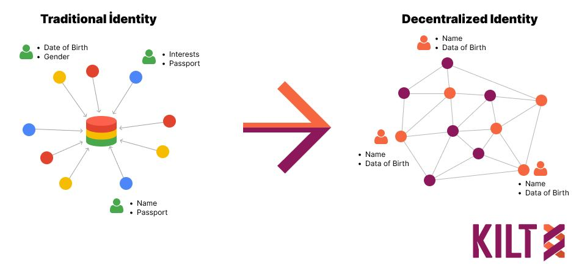

# July Info Bites

## 1

🍪 Information Bites 🍪

What are DIDs? 

- Currently, we have to rely on a centralized authority (such as a government) or singular monopoly (Google, Facebook, etc.) for our digital identity. They store our data in centralized databases and control our data. 

- But fear not, because DID is here to save the day! 🦸‍♀️💥

- DID stands for Decentralized Identifier, similar to a digital fingerprint. With DIDs, users can store and manage their own data and digital identity using technologies such as blockchain. 🔗

- Imagine being the captain of your own digital ship, with full control over your data and identity. ⚓️

- Because people are in full control of the data, they decide what information to share, and who to share it with, enhancing privacy and security. 🕵️‍♂️🔒

So, say goodbye to the centralized monopolies and embrace the power of decentralization! Claim Independence! 🙌✨

## 2

🍪 Information Bites 🍪

What are KILT DIDs?

- A KILT decentralized identifier (DID) is like a magical code that uniquely identifies each KILT user. It's like their secret key to the digital realm! 🧙‍♂️✨

For example, did:kilt:4sxSYXakw1ZXBymzT9t3Yw91mUaqKST5bFUEjGEpvkTuckar. Impressive, isn't it? 😮💫

- And here's the best part: DIDs can be used for people, machines, services, and anything else that wants to have an identity. It's a party where everyone's invited! 🎉🤖💼

- Now, let's talk about the two types of DIDs: Light DIDs and Full DIDs. Light DIDs are like cool secret agents working offline, while Full DIDs are the superheroes residing on the chain, ready to save the day! 🕵️‍♂️🦸‍♀️🔒

- But wait, there's more! A Full DID comes with some special powers. It supports an attestation key, which is used to write CTypes and attestations on the blockchain. It's like leaving your mark in the digital world! 📝🔏

- And that's not all! A Full DID also has a delegation key, which is used to write delegations on the blockchain.

So, with KILT DIDs, get ready to unlock your identity and embark on exciting journeys! 🗝️ Claim Independence! 🙌✨

## 3

🧐 Who is Deloitte? 🧐

- Deloitte offers integrated services that include Audit & Assurance, Consulting, Financial Advisory, Risk Advisory and Tax & Legal. Their approach combines insight and innovation from multiple disciplines with business and industry knowledge to help clients excel anywhere in the world.

How does Delloite use KILT?

- Deloitte Consulting AG announced the integration of KILT blockchain technology for issuing reusable digital credentials to support  Know Your Client (KYC) and Know Your Business (KYB) processes. These credentials have multiple use cases, including regulatory compliance for banking and Decentralized Finance (DeFi), age verification for e-commerce, private logins and fundraising.